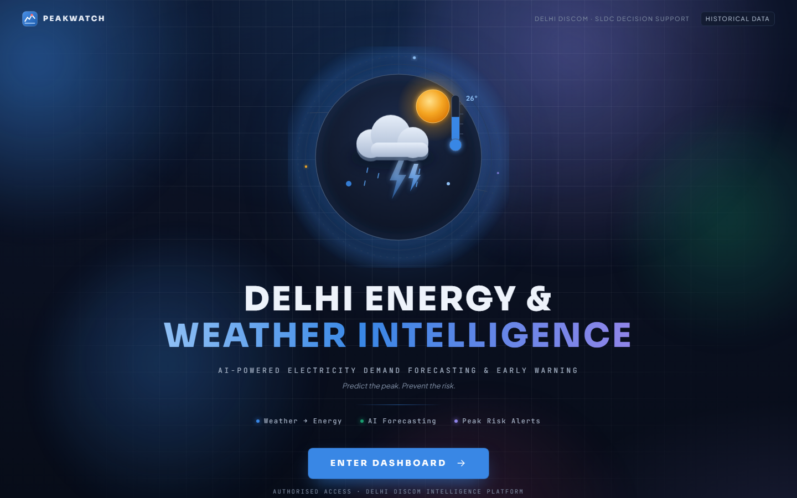
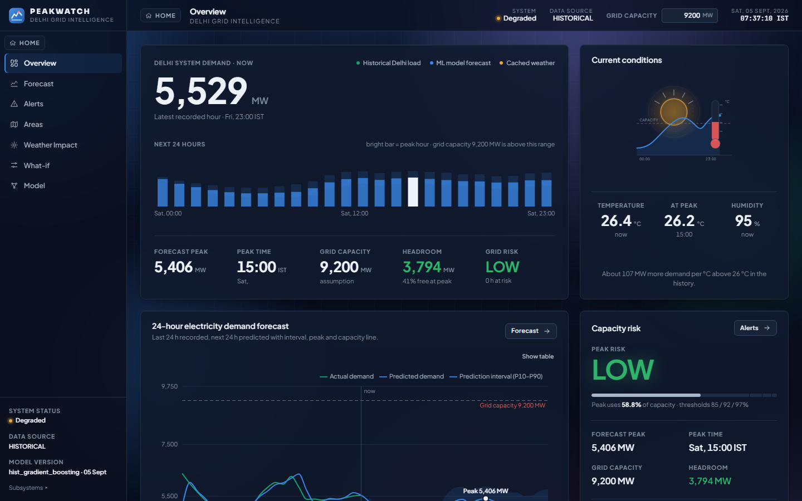
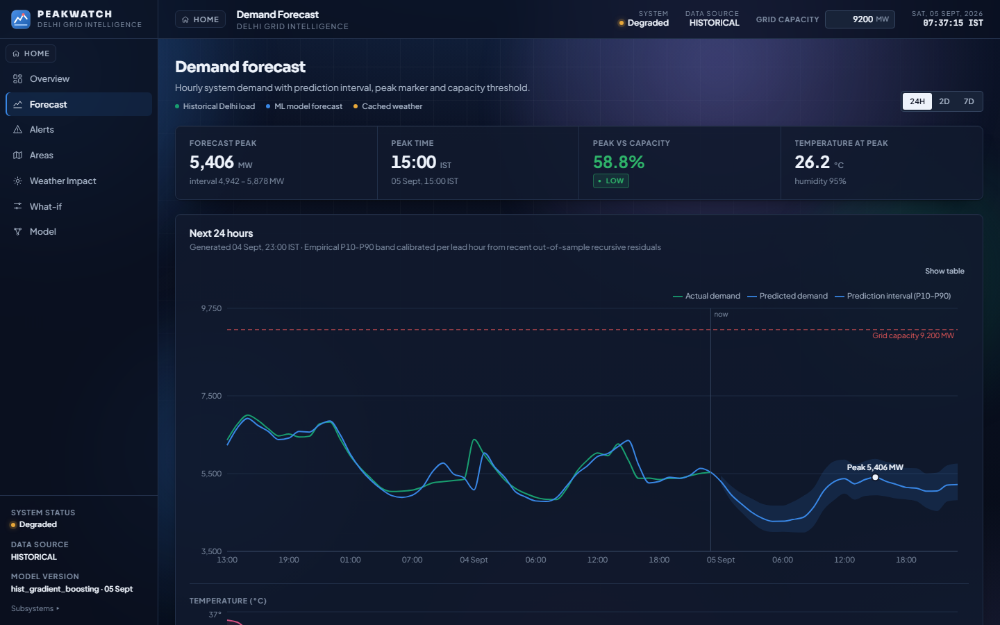
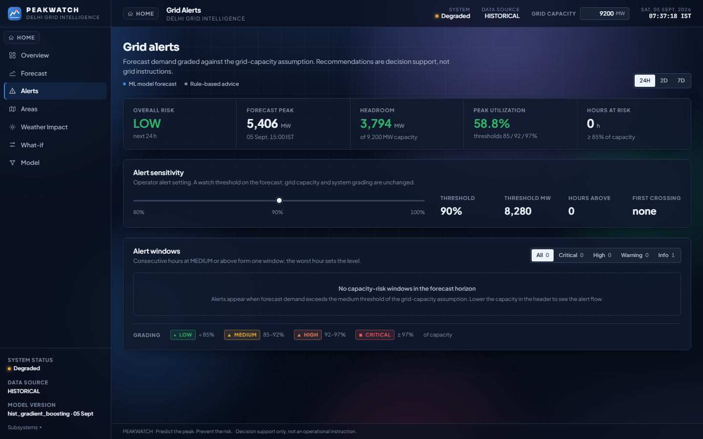
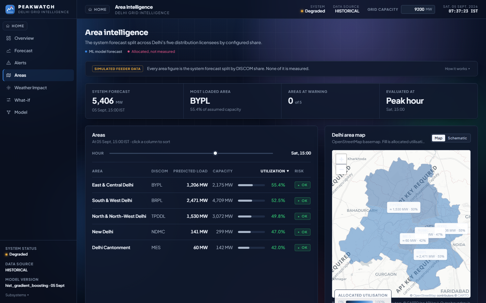
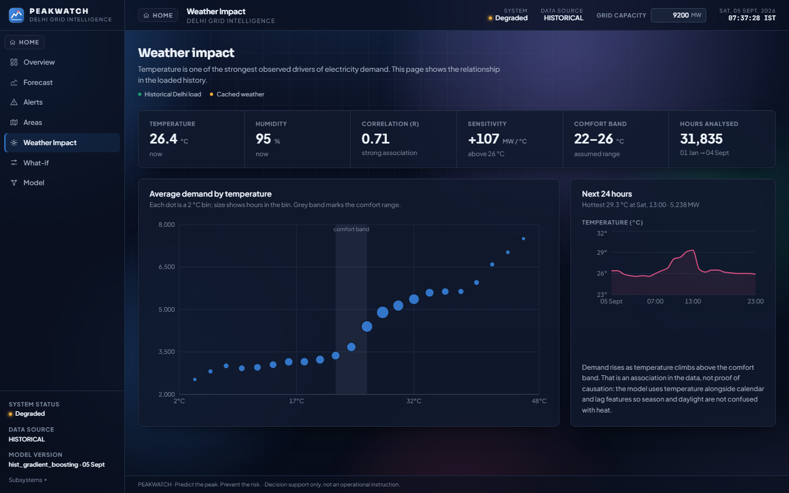
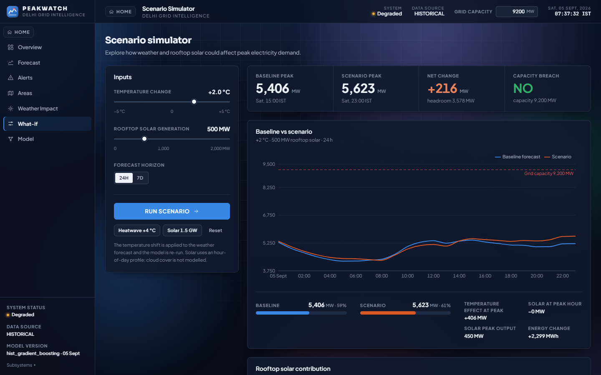
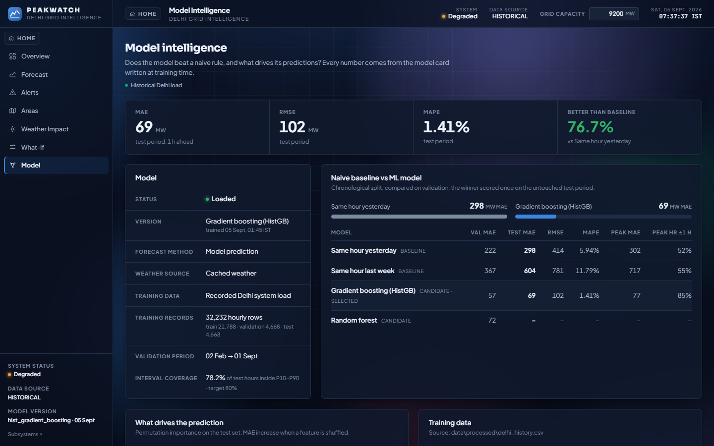
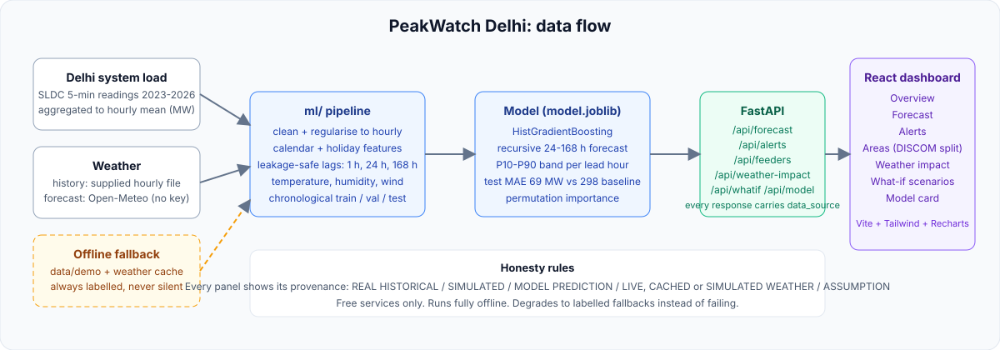

# PeakWatch Delhi

**See tomorrow's peak today.** An AI-powered electricity demand forecasting and early-warning
dashboard for Delhi DISCOM / SLDC operators. It forecasts the next 24 to 168 hours of system
load from real historical demand plus weather, grades the forecast against grid capacity, and
turns that into peak-risk alerts, an area-wise breakdown, weather-impact analysis and what-if
scenarios.


[](https://delhi-demand-forecast.vercel.app/)

**Live demo:** https://delhi-demand-forecast.vercel.app/ (the backend runs on Render's free
tier and sleeps when idle, so the first load can take up to a minute to show live figures).



## Contents

- [What it does](#what-it-does)
- [Screenshots](#screenshots)
- [How it works](#how-it-works)
- [Quick start](#quick-start)
  - [1. Backend (FastAPI)](#1-backend-fastapi)
  - [2. Frontend (React + Vite)](#2-frontend-react--vite)
  - [3. Run both with one command](#3-run-both-with-one-command)
  - [Check it is working](#check-it-is-working)
  - [Troubleshooting](#troubleshooting)
- [Configuration](#configuration)
- [Data honesty](#data-honesty)
- [API](#api)
- [Model](#model)
- [Tests](#tests)
- [Project layout](#project-layout)
- [Retraining on a new CSV](#retraining-on-a-new-csv)
- [Deployment](#deployment)
- [Limitations](#limitations)

## What it does

| Page | What the operator sees |
|---|---|
| **Overview** | Demand now, next-24-hour bar strip, forecast peak, headroom against grid capacity, risk level, current weather |
| **Forecast** | Hourly forecast for 24 h / 2 d / 7 d with a calibrated P10-P90 band, peak marker, capacity line and temperature track |
| **Alerts** | Risk grading (LOW / MEDIUM / HIGH / CRITICAL), alert windows, operator-adjustable watch threshold, rule-based advice |
| **Areas** | The system forecast split across the five Delhi DISCOMs, utilisation table, schematic map and hour-by-area heatmap |
| **Weather impact** | Temperature vs demand curve from the loaded history, correlation, MW per degree sensitivity, next-24-hour temperature |
| **What-if** | Re-run the model with a temperature shift and rooftop-solar injection and compare peaks against capacity |
| **Model** | Model card: MAE / RMSE / MAPE on the untouched test period, baseline comparison, interval coverage, feature importance |

Everything runs on a laptop with no paid service and no API key. If the network is down the
app keeps working on cached weather and bundled data, and every panel says so.

## Screenshots

| Overview | Demand forecast |
|---|---|
|  |  |

| Grid alerts | Area intelligence |
|---|---|
|  |  |

| Weather impact | Scenario simulator |
|---|---|
|  |  |

| Model intelligence |
|---|
|  |

The screenshots were captured from a local run on the committed real Delhi dataset. The
header shows *Degraded* because the weather came from cache rather than a live Open-Meteo
call, which is exactly what the app is supposed to report in that case.

## How it works



```
Historical load + weather -> cleaning -> ML forecast -> peak & capacity risk -> area risk -> what-if -> decision support
```

1. **Data.** Real Delhi system load (SLDC 5-minute readings, 2023 to 2026) is aggregated to an
   hourly mean and joined with hourly weather. The cleaned file ships in `data/processed/`.
2. **Features.** Calendar and Indian public holidays, temperature and derived cooling degrees,
   humidity, wind, and leakage-safe lags (1 h, 24 h, 168 h) with rolling means.
3. **Model.** scikit-learn HistGradientBoosting chosen over RandomForest on a chronological
   validation split, scored once on an untouched 2026 test period, then refit. The 24-hour
   forecast is recursive and its P10-P90 band is calibrated separately for each lead hour.
4. **API.** FastAPI serves forecast, alerts, area split, weather impact, what-if and the model
   card. Every response carries `data_source`, and forecasts also carry `forecast_method` and
   `weather_source`.
5. **Dashboard.** React + Vite + Tailwind + Recharts in a dark control-room theme; chart colours are
   validated for colour-vision safety on the dark surface. Every panel handles loading, error and
   empty states and labels its provenance.

## Quick start

**Prerequisites**

| Tool | Version | Check |
|---|---|---|
| Python | 3.11 or newer (3.13 is what we run) | `python --version` |
| Node.js | 20 or newer | `node --version` |
| Git | any | `git --version` |

No API keys. No database. Open-Meteo is keyless and everything else is local files.

```powershell
git clone https://github.com/tanmaytiwari37/delhi-demand-forecast.git
cd delhi-demand-forecast/delhi-demand-forecast
```

The repository root holds only `render.yaml`, `vercel.json` and `LICENSE`; the application lives in the
`delhi-demand-forecast/` folder, which is the one that contains
`backend/`, `frontend/` and `ml/`. Every command below is run from that folder unless it says
otherwise.

### 1. Backend (FastAPI)

Windows PowerShell:

```powershell
python -m venv .venv
.\.venv\Scripts\Activate.ps1
pip install -r backend/requirements.txt
python -m uvicorn backend.main:app --reload --port 8000
```

macOS / Linux:

```bash
python3 -m venv .venv
source .venv/bin/activate
pip install -r backend/requirements.txt
python -m uvicorn backend.main:app --reload --port 8000
```

You should see:

```
INFO backend.services.data_store: Loaded REAL history from data\processed\delhi_history.csv (32232 rows)
INFO backend.services.data_store: Model loaded from ...\ml\models\model.joblib (hist_gradient_boosting, trained on real data)
INFO:     Uvicorn running on http://127.0.0.1:8000
```

- API root: http://localhost:8000
- Interactive docs (Swagger): http://localhost:8000/docs
- Health: http://localhost:8000/api/health

Leave this terminal open. The backend must stay running for the dashboard to have data.

### 2. Frontend (React + Vite)

Open a **second** terminal:

```powershell
cd frontend
npm install
npm run dev
```

You should see:

```
VITE v8.x.x  ready in ... ms
➜  Local:   http://localhost:5173/
```

Open http://localhost:5173 in a browser. The landing page loads first; click **Enter dashboard**.

The dev server proxies every `/api/*` call to `http://localhost:8000`, so the browser makes
same-origin requests and no CORS setup is needed.

### 3. Run both with one command

On Windows a helper script opens the backend and the frontend in two PowerShell windows:

```powershell
.\scripts\dev.ps1
```

It assumes you have already run `pip install -r backend/requirements.txt` and
`npm install` once. If PowerShell refuses to run the script, allow local scripts for the
current session first:

```powershell
Set-ExecutionPolicy -Scope Process -ExecutionPolicy Bypass
.\scripts\dev.ps1
```

On macOS / Linux, run the two commands from steps 1 and 2 in two terminals, or in one shell:

```bash
(python -m uvicorn backend.main:app --reload --port 8000 &) && cd frontend && npm run dev
```

### Check it is working

```powershell
curl http://localhost:8000/api/health
```

Expected:

```json
{"status":"ok","model_loaded":true,"model_status":"loaded","data_source":"real","weather_source":"live","version":"0.2.0"}
```

- `data_source` is `real` when the committed Delhi dataset loaded, `demo` when the app fell
  back to simulated history.
- `weather_source` is `live` after a successful Open-Meteo call, `cache` when it served the
  last good response, `demo` when neither was available.
- `model_loaded` must be `true`. If it is `false` the API still answers with a labelled
  heuristic forecast while a model trains in the background.

Then open the dashboard and check that the header badge reads **DATA SOURCE HISTORICAL** and
the footer of the sidebar shows the model version.

### Troubleshooting

| Symptom | Cause and fix |
|---|---|
| Dashboard says *Cannot reach the API* | The backend is not running or is on a different port. Start step 1 and confirm http://localhost:8000/api/health answers. |
| `Address already in use` on 8000 or 5173 | Another process holds the port. Stop it, or run `uvicorn ... --port 8001` and `npm run dev -- --port 5174`. If you change the API port, update the proxy target in `frontend/vite.config.ts`. |
| Vite prints `Failed to resolve dependency: react` or `could not be resolved` although `npm install` succeeded | Happens when the project lives inside a OneDrive or Dropbox folder on Windows: every file is a reparse point and Vite 8's resolver treats them as symlinks. `frontend/vite.config.ts` sets `resolve.preserveSymlinks: true` to handle this. If you still see it, delete `frontend/node_modules/.vite` and restart, or copy the project to a non-synced path such as `C:\dev\`. |
| Header shows *System Degraded* | Open-Meteo could not be reached, so the weather is cached or simulated. The forecast still runs. This is reported deliberately, not hidden. |
| `data_source` is `demo` | `data/processed/delhi_history.csv` was not found. Check the path or set `PEAKWATCH_HISTORY_CSV` in `.env`. |
| First start in demo mode is slow | The API serves heuristic forecasts immediately and trains a demo model in the background (10 to 15 s); the badge switches from HEURISTIC ESTIMATE to MODEL PREDICTION on its own. |
| `pip install` fails to build a wheel | Use Python 3.11 to 3.13 on a 64-bit install; all dependencies ship prebuilt wheels for those versions. |

## Configuration

Copy `.env.example` to `.env` and edit what you need. All backend variables are prefixed
`PEAKWATCH_`. Nothing in the file is a secret.

| Variable | Default | Purpose |
|---|---|---|
| `PEAKWATCH_CAPACITY_MW` | `9200` | Grid capacity planning assumption used for risk levels. Also editable in the dashboard header. |
| `PEAKWATCH_HISTORY_CSV` | `data/processed/delhi_history.csv` | Cleaned real dataset. Point at a missing file to force demo mode. |
| `PEAKWATCH_MODEL_PATH` | `ml/models/model.joblib` | Trained model used with real data. |
| `PEAKWATCH_WEATHER_ENABLED` | `true` | Set `false` to skip Open-Meteo entirely. |
| `PEAKWATCH_WEATHER_TIMEOUT_S` | `8` | Seconds before a live weather call gives up and falls back. |
| `PEAKWATCH_WEATHER_CACHE_TTL_MIN` | `180` | How long a cached forecast is reused. |
| `PEAKWATCH_FIXED_NOW` | empty | Freeze the clock (ISO 8601 with IST offset) for a reproducible demo. |
| `PEAKWATCH_CORS_ORIGINS` | `http://localhost:5173,...` | Allowed browser origins when not using the Vite proxy. |
| `VITE_API_BASE` | empty | Frontend only (`frontend/.env`). Leave empty locally to use the proxy. |

## Data honesty

The app never presents simulated data as real Delhi operational data. Every panel carries a badge:

| Badge | Meaning |
|---|---|
| **REAL HISTORICAL** | operator-supplied CSV loaded via `PEAKWATCH_HISTORY_CSV` |
| **SIMULATED DEMO DATA** | synthetic history from `ml/demo_data.py`, calibrated only to public ranges |
| **MODEL PREDICTION** | output of the trained model (the badge also says what data it was trained on) |
| **HEURISTIC ESTIMATE** | same-hour-last-7-days fallback while no model is loaded |
| **LIVE / CACHED / SIMULATED WEATHER** | Open-Meteo forecast, its cache, or the demo generator |
| **ASSUMPTION** | editable demo parameter (grid capacity 9,200 MW planning assumption, risk thresholds 85 / 92 / 97 %) |
| **ALLOCATED, NOT MEASURED** | the DISCOM / area split is the system forecast divided by configured shares |
| **RULE-BASED ADVICE** | system-generated recommendation, not an operational instruction |

## API

Endpoint behaviour and failure modes are described in [docs/ARCHITECTURE.md](delhi-demand-forecast/docs/ARCHITECTURE.md).
The exact request and response schemas are in the Swagger UI at http://localhost:8000/docs
while the backend runs.

| Method | Path | Notes |
|---|---|---|
| GET | `/api/health` | liveness, model status, data and weather source |
| GET | `/api/status` | provenance, freshness, assumptions, model card summary |
| GET | `/api/model` | metrics, baselines, permutation importance |
| GET | `/api/forecast?horizon=24` | 1 to 168 h, optional `capacity_mw` |
| GET | `/api/actual?hours=48` | recorded demand with 1-hour-ahead backtest |
| GET | `/api/alerts?horizon=24` | risk level, headroom, alert windows |
| GET | `/api/feeders?ts=` | DISCOM split and hourly heatmap |
| GET | `/api/weather-impact` | temperature vs load statistics |
| POST | `/api/whatif` | `{temp_delta_c, rooftop_solar_mw, horizon, capacity_mw?}` |

Example:

```powershell
curl "http://localhost:8000/api/forecast?horizon=24"
curl -X POST http://localhost:8000/api/whatif -H "Content-Type: application/json" -d "{\"temp_delta_c\": 3, \"rooftop_solar_mw\": 500, \"horizon\": 24}"
```

## Model

- **Training data:** real Delhi system load, hourly mean of SLDC 5-minute readings,
  2023-01 to 2026-09, joined with hourly weather.
- **Split:** chronological. Train 2023-01 to 2025-07, validation 2025-07 to 2026-02, test
  2026-02 to 2026-09 (includes summer 2026). The test period is never touched during selection.
- **Features:** hour, weekday, day of year, weekend, Indian public holidays; temperature,
  temperature squared, cooling / heating degrees, humidity, wind; lags 1 h, 24 h, 168 h and
  rolling means 24 h and 7 d. All lag features use only values before the target hour.
- **Candidates:** HistGradientBoosting (selected, validation MAE 57.5 MW) and RandomForest
  (72.3 MW).

| Metric on the untouched test period | Value |
|---|---|
| 1-hour-ahead MAE | 69.4 MW (MAPE 1.4 %) |
| Same-hour-yesterday baseline MAE | 297.9 MW |
| Improvement over baseline | 76.7 % |
| Daily-peak MAE | 76.8 MW |
| Peak-hour hit rate (within 1 h) | 85 % |
| P10-P90 coverage, 1-step | 78.2 % (target 80 %) |
| P10-P90 coverage, recursive 24 h | 75.2 % (target 80 %) |

- **Prediction band:** empirical P10-P90 of the model's out-of-sample residuals over a rolling
  28-day window, calibrated per lead hour for the recursive forecast. Coverage is slightly
  below the nominal 80 % and the dashboard says so.
- **Explainability:** permutation importance on the test set. Metered history dominates
  (demand 1 h ago, hour of day, same hour yesterday); temperature matters mainly through the lags.
- **Known weakness:** the recursive 24-hour forecast under-predicts the peak on the hottest
  days by roughly 300 MW.

## Tests

```powershell
python -m pytest -q          # 40 API + ML tests, no network needed
cd frontend
npx tsc -b                    # type-check the dashboard
npm run lint
```

## Project layout

```
backend/     FastAPI: main.py, config.py (constants + Settings), routers/, services/, models/, utils/
ml/          schema, data/loader, features, calendar, baseline, training/, evaluation/, inference/, demo_data
ml/models/   model.joblib (trained on real data) and demo_model.joblib
frontend/    React + Vite + Tailwind + Recharts dashboard (src/pages, components, services/api.ts, hooks, types)
scripts/     inspect_dataset.py, train_model.py, generate_demo_csv.py, fetch_weather_history.py, dev.ps1
tests/       pytest suite
data/        raw/ (never committed)  processed/ (committed cleaned history)  demo/ (offline fallback)  cache/
docs/        ARCHITECTURE.md, HACKATHON_PLAN.md, images/
```

## Retraining on a new CSV

Do not retrain blindly. The pipeline enforces a checklist:

```powershell
# 1. Inspect: schema, timestamps, gaps, units, outliers, coverage, suitability
python scripts/inspect_dataset.py data/raw/delhi_load.csv

# 2. Build the hourly history (joins a supplied weather file, or fetches the Open-Meteo archive)
python scripts/fetch_weather_history.py --csv data/raw/delhi_load.csv --weather-csv data/raw/delhi_weather.csv --out data/processed/delhi_history.csv

# 3. Train: baselines vs candidates, chronological split, test-set metrics, calibrated bands
python scripts/train_model.py --csv data/processed/delhi_history.csv --out ml/models/model.joblib
```

Then set `PEAKWATCH_HISTORY_CSV` to the processed file and restart the API. The loader accepts
common column aliases (`ts`, `load_mw`, `temp`, ...) and requires only `timestamp` and
`demand_mw`; optional columns (temperature, humidity, wind, solar, holiday) are used when present.

## Deployment

Deployed copy: **https://delhi-demand-forecast.vercel.app/**

The hackathon demo runs locally. Deployment is a bonus and uses two free services from the
same GitHub repo. Nothing here changes the local path.

| Service | Platform | Root directory | Needs |
|---|---|---|---|
| Backend (FastAPI) | Render, free web service | `delhi-demand-forecast` (set by the root `render.yaml`) | nothing else; `PORT` is injected by Render |
| Frontend (Vite static build) | Vercel | `delhi-demand-forecast/frontend` | nothing else; `frontend/vercel.json` proxies `/api/*` to the Render URL |

**Backend on Render (do this first)**

1. Open https://dashboard.render.com, choose New, then **Blueprint**, connect the GitHub repo
   and apply. Render reads the root `render.yaml` (build `pip install -r backend/requirements.txt`,
   start `python -m backend.main`, health check `/api/health`, Python 3.13).
2. Leave `PEAKWATCH_FRONTEND_ORIGIN` blank; the frontend proxies through Vercel so CORS is not involved.
3. Wait for "Live", then open `https://<service>.onrender.com/api/health`. It must return
   `"data_source": "real"` and `"model_loaded": true`.
4. If Render added a suffix to the service name, put the real hostname in the `/api/:path*`
   rewrite of `frontend/vercel.json` and the root `vercel.json`, commit and push.

**Frontend on Vercel**

5. https://vercel.com/new, import the repo, set **Root Directory** to
   `delhi-demand-forecast/frontend`, deploy. Framework preset Vite, build `npm run build`,
   output `dist`. No environment variable is required.
6. Open the Vercel URL. The front page loads immediately; live figures appear once Render is awake.

Optional: setting `VITE_API_BASE=https://<service>.onrender.com` on Vercel makes the browser
call Render directly. If you do that, also set `PEAKWATCH_FRONTEND_ORIGIN=https://<app>.vercel.app`
on Render for CORS.

**Free-tier caveat.** Render free services sleep after about 15 minutes idle and take up to a
minute to wake. Open the health URL a minute before a demo. Never rely on the deployed copy
for the live demo.

## Limitations

- The DISCOM / area split is a proportional allocation of the system forecast, not measured
  feeder data. Area capacities are approximate upper bounds from published DISCOM peaks.
- Grid capacity (9,200 MW) and the alert thresholds are planning assumptions, not SLDC
  operating limits. Both are editable.
- The historical weather file's provenance is not verified; it is labelled `supplied_file`
  and is not presented as Open-Meteo.
- Rooftop solar in the what-if uses a fixed hour-of-day profile; cloud cover is not modelled.
- The recursive 24-hour band is honest but wide (about 940 MW at lead 24) and still slightly
  under the nominal 80 % coverage.
- The demo dataset and demo model exist only as an offline fallback; their accuracy says
  nothing about real Delhi load.
